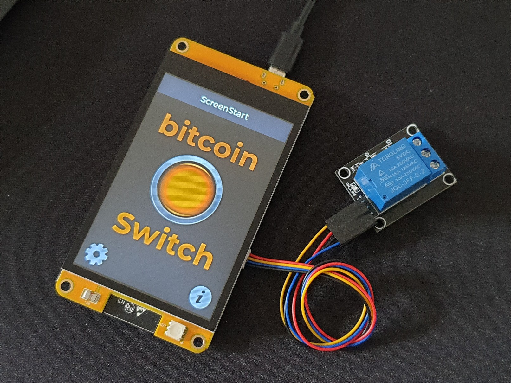

# offline⚡️Switch

<!--- --->

 

## Short description

The offline⚡️Switch is a bitcoinSwitch with an ESP32-based smart display (made by Sunton). It is based on the offline payment functionality of bitcoinVend or LNPoS. The offline⚡️Switch itself does not need to be online, only the payer. The offline⚡️Switch can display a QR code (LNURL) on the display. The user's wallet scans the QR code and connects online to the LNbits server. If the Invoice has been paid, the user is shown a "secret" as a four-digit PIN. If this PIN is entered via the touch panel into the offline⚡️Switch, then the condition is fulfilled for him and the switch is switched. The configuration can be done exclusively via the display, which considerably reduces the technical requirements. As a basis for this smart display project I could use the BliksemBier from Pieter.

## Requirements

- Sunton 3.5" 320*480 Smart Display ESP32-3248S035 (with R for Resistive or C for Capacitive Touch Screen (C = recommended))
- 5V Relay (High-Level-Triggered)

## Relay connection

The connection of a relay is quite simple. The supplied cable is sufficient. The classic 5V relays usually have three connections. Supply (5V), Ground (GND) and Signal (Sig). The ESP32 delivers only 3.3V, but for most 5V relays this should be enough. Connect `3,3V` (red), `GND` (black) and the signal `IO21` (yellow) as shown in the picture. The blue line for IO22 remains unused here.

## Flash firmware

### Web installer (recommended)

Go to the [web installer](https://satoffee.danielpcostas.dev/) and follow instructions. This is the easiest way to flash firmware and load config.

#### Web installer troubleshooting

- It works with chrome, chromium, brave.
- Build errors > If during firmware flash upload stops, it's recommended to enter the board in boot mode. Unplug cable, hold right bottom button and then plug cable. Try again programming.

### Manual flashing

- Install [Arduino IDE](https://www.arduino.cc/en/software)
- Install ESP32 boards, using [boards manager](https://github.com/espressif/arduino-esp32/releases/download/2.0.9/esp32-2.0.9.zip)
- Download this repo
- Download and install the libraries into your Arduino install "libraries" folder (see table below)
- Open [satoffee.ino](./satoffee/satoffee.ino) file in the Arduino IDE
- Select the correct ESP32 board from tools > board. Please refer to [T-Display-S3](https://github.com/Xinyuan-LilyGO/T-Display-S3) to set the correct settings of the ESP32. The only difference is on `Partition Scheme`, please select `16M Flash (3MB APP/9.9MB FATFS)`
- Compile and upload to device

| Used library     | Version | Link                                                              |
| :--------------- | :------ | :---------------------------------------------------------------- |
| WiFi             | 2.0.0   | Included in ESP32 boards manager                                  |
| WiFiClientSecure | 2.0.0   | Included in ESP32 boards manager                                  |
| FS               | 2.0.0   | Included in ESP32 boards manager                                  |
| FFat             | 2.0.0   | Included in ESP32 boards manager                                  |
| SPI              | 2.0.0   | Included in ESP32 boards manager                                  |
| SPIFFS           | 2.0.0   | Included in ESP32 boards manager                                  |
| WebSockets       | 2.3.6   | [link](https://github.com/Links2004/arduinoWebSockets/tree/2.3.6) |
| OneButton        | 2.0.4   | [link](https://github.com/mathertel/OneButton/tree/2.0.4)         |
| ArduinoJson      | 6.19.0  | [link](https://github.com/bblanchon/ArduinoJson/tree/v6.19.0)     |
| QRCode           | 0.0.1   | [link](https://github.com/ricmoo/QRCode/tree/v0.0.1)              |
| TFT_eSPI         | 2.5.0   | [link](./libraries/TFT_eSPI.zip)                                  |

## Configuration

After flashing the firmware and starting the Satoffee for the first time it will enter on `serial config mode` automatically, please go to the [web installer](https://satoffee.danielpcostas.dev/) and follow step 2 for loading config values

### Buttons

#### Left button

- One click → test screen mode (will loop all screens, keep clicking).
- Hold 5 seconds → enter serial config mode.

#### Right button

- One click → show help (will loop help screens)

## Aknowledgement

This project use bits from 
[BliksemBier](https://github.com/pieterjm/BliksemBier) from Pieter and
[bitcoinVend](https://github.com/arcbtc/bitcoinVend) from Ben Arc

## Donations/contributions

Donations and contributions are welcome.

Lightning⚡Address: <axelhamburch@ereignishorizont.xyz>
